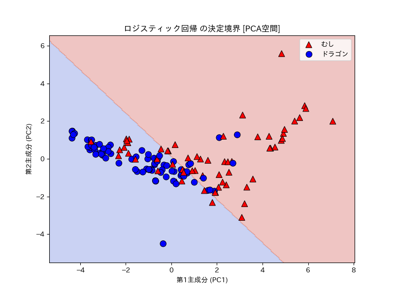
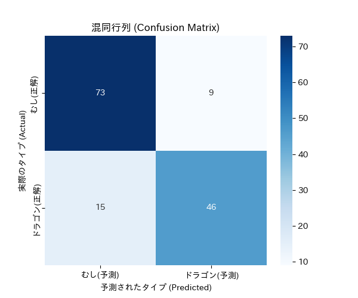
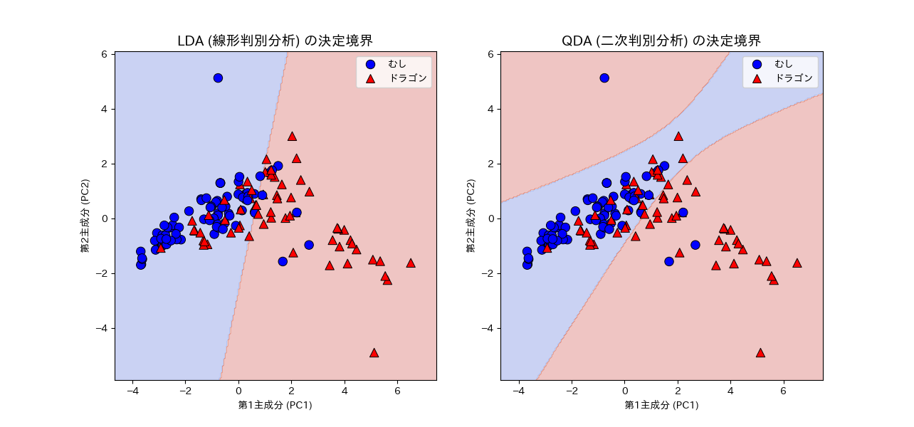
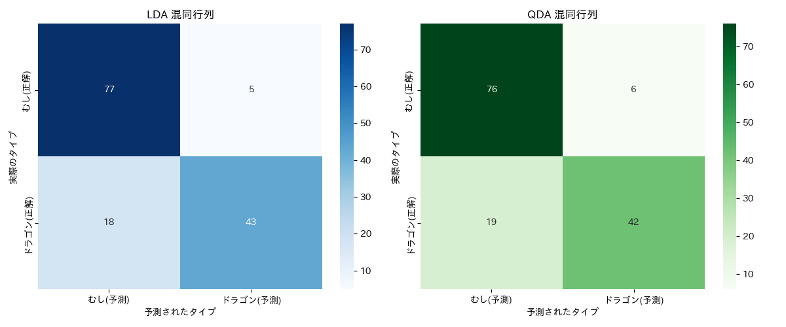
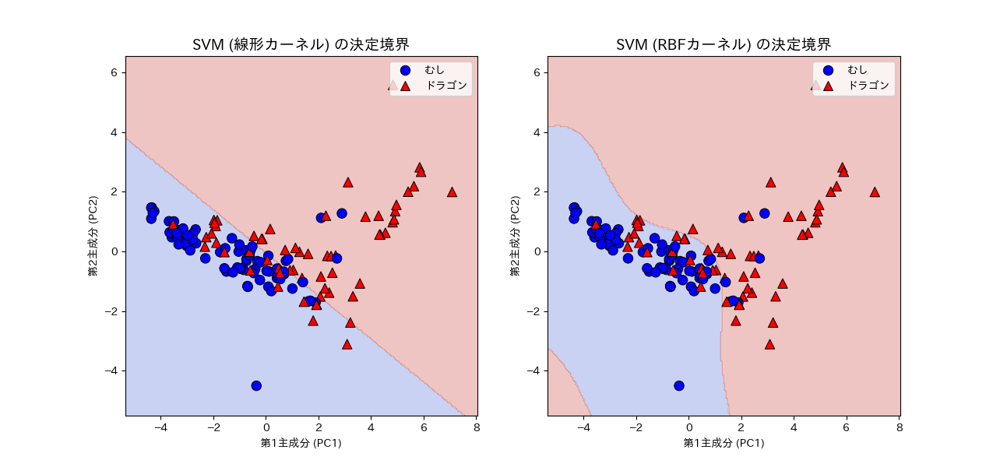
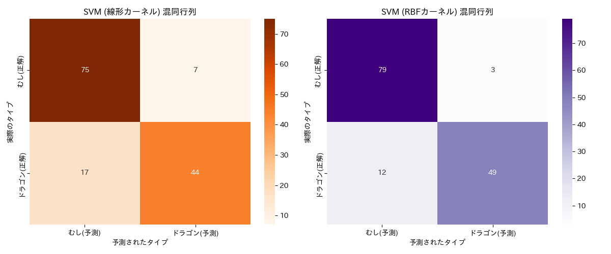

# ポケモンデータを用いた判別分析（むしタイプ vs ドラゴンタイプ）
## 1. はじめに・分析の背景
本プロジェクトは、機械学習における二値分類（判別分析）の手法を比較・検証するための分析レポートです。

「むしタイプは全体的にステータスが低く（弱い）、ドラゴンタイプはステータスが高い（強い）」 という、ポケモンプレイヤーの間で広く知られている漠然としたイメージ（偏見）があります。このステータスや身体的特徴の顕著な違いを利用すれば、ポケモンの種族値データなどから「そのポケモンがむしタイプか、ドラゴンタイプか」を高い精度で機械的に判別できるのではないか？と考えたのが本分析のきっかけです。

身近で興味深いポケモンのデータを用いることで、各分類アルゴリズム（線形・非線形）の挙動や、決定境界の引かれ方の違いを直感的に理解することを目的としています。

## 2. 使用データと前処理
* **ファイル名**: poke_preparation.py

* **データソース**: ポケモン種族値データ よりスクレイピングにて取得。

* **対象データ**: 「むしタイプ」または「ドラゴンタイプ」を持つポケモン（複合タイプ含む）。

* **使用した説明変数**:
HP、攻撃、防御、特攻、特防、素早、合計種族値、高さ、重さ、捕獲率、経験値、初期なつき度、（全12変数）

* **前処理**:
    * 欠損値を含むデータ（性別不明など）の除外

    * スケールの異なる変数を揃えるための標準化（StandardScaler）

## 3. 分析手法と結果
本分析では、以下の5つのアルゴリズムを用いてモデルの構築と評価を行いました。次元数の多いデータセットであるため、それぞれのモデルにおいて適切な変数選択（次元削減）や多重共線性の回避を行っています。

### 3.1 ロジスティック回帰分析
確率モデルを用いて、あるポケモンがドラゴンタイプである確率を予測しました。

* **ファイル名**: poke_logisticregression.py
* **変数選択**: L1正則化（ラッソ回帰）

    不要な変数の係数を0に圧縮することでスパース性を持たせました。

* **選択された主な変数**: 防御、特攻、特防、素早、高さ、重さ、捕獲率、経験値、初期なつき度（HP、攻撃、合計種族値は除外）

* **基本指標**:

    * **正解率 (Accuracy)**: 83.2%

    * **疑似決定係数 (Pseudo R-squ.)**: 0.39

* **P値**: 「捕獲率」と「初期なつき度」のP値が0.10を下回り、統計的に有意に判別に寄与していることが確認できた。

* **結果の可視化**:

* **考察**:

    * **むし → ドラゴンと誤認**: ゲノセクト、マッシブーン、フェローチェ、ウルガモスなど。これらは「伝説のポケモン」や「ウルトラビースト」と呼ばれる極めてステータスが高いむしタイプであり、AIが「ステータスが高い＝ドラゴン」と誤認しました。

    * **ドラゴン → むしと誤認**: フカマル、タツベイ、キバゴ、オンバットなど。これらは進化前のいわゆる「幼生ドラゴン」であり、種族値が低く、背も低くて軽いため「むしタイプ」側に分類されてしまいました。

### 3.2一般的な判別分析

* **ファイル名**: poke_LDA_QDA.py

#### 3.2.1 線形判別分析 (LDA)
データを最もよく分離する直線の境界線（線形判別関数）を求めて分類しました。

* **変数選択**: VIF（分散拡大係数）による多重共線性の排除。全変数から「合計種族値」などの相関が強すぎる（VIF > 10）変数を機械的に除外して学習させました。

* **正解率**: 83.9%

* **結果の可視化と考察**は3.2.2にて

#### 3.2.2 二次判別分析 (QDA)
クラスごとに異なる分散共分散行列を仮定し、二次関数（曲線）の境界線を引いて分類しました。

* **変数選択**: LDAと同様にVIFを用いて多重共線性を回避。

* **正解率**: 82.5%

* **結果の可視化**:

* **考察**:

    * **線形判別分析**: 正解率はロジスティック回帰とほぼ同等です。誤分類の傾向も似ており、ガブリアスのような大型ドラゴンも一部誤分類されていますが、基本的には「強いむし」と「弱いドラゴン」という直線の境界線では分離不可能な例外グループが誤答の中心となっています。

    * **二次判別分析**: 意外なことに、直線を引くLDAよりも正解率が下がりました。

    * 特筆すべき誤判別として「ヌケニン（HPが必ず1になる特殊なむしタイプ）」がドラゴンとして誤認されています。QDAはデータの「分散（ばらつき）」に敏感なため、ヌケニンのような極端な外れ値が存在すると境界線が歪んでしまい、メガボーマンダやラティアスのような本来分かりやすいはずのドラゴンタイプまで巻き添えで誤判別してしまったと考えられます。

### 3.3 サポートベクターマシン

* **ファイル名**: poke_SVM.py

#### 3.3.1 線形カーネルのサポートベクターマシン
マージン最大化の原則に基づき、クラス間の境界を直線で引く手法です。

* **変数選択**: LDA/QDAと同様にVIFを使用。

* **正解率**: 83.2%

* **結果の可視化と考察**は3.3.2にて

#### 3.3.2 非線形カーネルのサポートベクターマシン
非線形カーネル（ガウシアンカーネル）を用い、複雑に入り組んだデータに対しても柔軟に境界線を引く手法です。

* **変数選択**: LDA/QDAと同様にVIFを使用。

* **正解率**: 89.5%

* **結果の可視化**:

* **考察**:

    * **線形カーネルのサポートベクターマシン**: 正解率・誤判別の傾向ともに、ロジスティック回帰（83.2%）やLDA（83.9%）とほぼ同じ結果となりました。このデータセットにおいて、「直線で分離できる限界の精度」が概ね83%付近にあることが証明されたと言えます。

    * **非線形カーネルのサポートベクターマシン**: 線形モデルの限界（83%の壁）を大きく突破し、約90%の精度を叩き出しました。

    * 「進化前で弱いドラゴン」や「伝説級で強いむし」といった、特徴空間において相手の陣地にポツンと入り込んでしまっている「例外的なポケモン」の周りを、非線形カーネル特有の柔軟な境界線で上手く囲い込むことができたため、正解率が飛躍的に向上しました

## 4. 全体のまとめと比較・考察
### 【まとめ】
本分析を通じて、初期の仮説である「むしタイプ＝弱い・軽い、ドラゴンタイプ＝強い・重い」という特徴空間の偏りはデータ上でも明確に存在しており、機械学習モデルによって高い精度（80%以上）で二値判別が可能であることが証明されました。
### 【各モデルの比較と特徴】
* **線形モデル（ロジスティック回帰、LDA、SVM線形）**:

    PCAで次元圧縮した散布図からも分かる通り、シンプルに直線を引くだけでも十分な精度が出ました。これは2つのタイプの大半がステータス空間において明確に分かれていることを示しています。

* **非線形モデル（QDA、SVM非線形）**:

    QDAやRBFカーネルを用いることで正解率はさらに向上しました。
    しかし、「種族値の高いむし（ウルガモス、マッシブーンなど）」 や 「未進化で種族値の低いドラゴン（ミニリュウ、ヌメラなど）」 といった、仮説の例外となるポケモンが境界線付近に混在しているため、RBFカーネルではこれらを無理やり分類しようとして決定境界が複雑化（過学習気味に）なる傾向が確認できました。
### 【結論】
ポケモンのタイプ判別においては、ステータスの全体的な傾向（ドメイン知識）は非常に有用な特徴量となります。しかし、「むしタイプでありながら伝説のポケモン級に強い」「ドラゴンタイプだがとても小さい」といった例外的な存在（外れ値） が一定数存在するため、モデルの複雑さ（線形 vs 非線形）の選択には、精度と過学習のトレードオフを慎重に見極める必要があることが分かりました。
